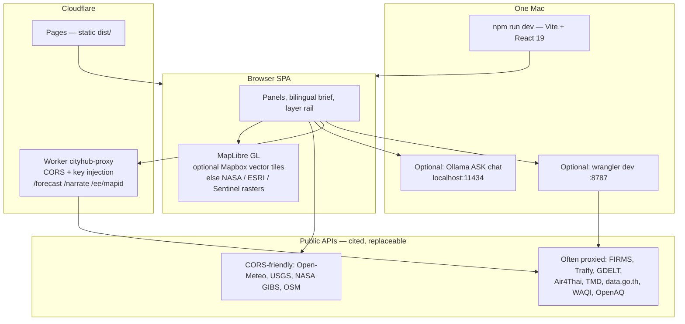

# City Hub


**Bangkok civic intelligence / smart-city OS** — independent of vendors. Live air, water, traffic, satellite, civic reports, and a bilingual morning brief on one screen.

This is **not** an official product of BMA, DEPA, or any government. It is independent civic software by [Non Arkaraprasertkul](https://github.com/Nonarkara). Fork it. Run it on one Mac.

> เมืองที่เข้าใจเรา และเราเข้าใจเมือง — *the city that understands us, and we understand the city.*

---

## What this is

City Hub is a replicable **civic intelligence dashboard**. Bangkok is the full-tier city (`tier: 'full'` in `src/config/cities.ts`). Other cities in that same registry — Chiang Mai, Phuket, Singapore, Kuching, Kranj, Ljubljana, and more — run on global open sources (`tier: 'lite'`). Adding a city is one config object; pointing the map at a typed name uses OpenStreetMap Nominatim for a session-only view.

It exists so a resident, journalist, or city operator can open one tab and see **what the sensors say next to what the press says**, with every figure cited. It is not a brochure dashboard. Layers that are pending, historical, mocked, or key-gated say so in `src/config/bangkok-layers.ts`.

The product name in the UI is **Dr Non's City Hub**. `package.json` version is `0.9.4`. GitHub description: *Bangkok civic intelligence hub — live PM2.5, satellite, alerts. Independent of any vendor platform.*

### What Bangkok mode actually wires

Drawn from the layer catalog and data modules — not from marketing copy:

| Domain | Sources in this repo |
| --- | --- |
| Air | GISTDA PM2.5, Air4Thai (PCD), Open-Meteo AQI, WAQI, OpenAQ |
| Water / flood | GISTDA live + historical flood polygons, Thaiwater quality and levels |
| Fire | NASA FIRMS (needs Worker `FIRMS_MAP_KEY` or `VITE_FIRMS_MAP_KEY`); GISTDA hotspots are a **historical 2023 snapshot**, not live |
| Traffic | Longdo / iTIC live tiles + incidents (default-on); TomTom flow/incidents if `VITE_TOMTOM_KEY` is set |
| Civic | Traffy Fondue citizen reports (points + heatmap) |
| Weather | TMD 7-day official forecast (Thai + English); Open-Meteo |
| Satellite | NASA GIBS (true color, night lights, LST, NDVI, aerosol, …), ESRI World Imagery, EOX Sentinel-2 cloudless; AlphaEarth / Sentinel-5P / GHSL need Earth Engine Worker secrets |
| 3D twin | OSM footprints baked to GeoJSON (`public/geo/bkk-buildings.geojson`, ODbL); heights from OSM, not invented |
| Narrative | GDELT headlines + sentiment; Reality Check verdict (CALM / UNDERSTATED / CONFIRMED / OVERSTATED) vs sensors |
| Brief | Governor-style panel; optional Gemini narration via the Worker; optional local Ollama ASK chat |

Transit rail geometry is a **hand-curated** BTS/MRT/ARL GeoJSON. The `gtfs-transit-live` layer is documented in the catalog as a **mock** GTFS-RT simulation — not a live operator feed.

---

## Philosophy

Five tenets this public README is written to:

1. **One Mac.** The SPA is Vite on localhost. The CORS proxy is one Cloudflare Worker you can also run with `wrangler dev`. ASK chat defaults to Ollama on *your* machine (`http://localhost:11434`) — nothing leaves it unless you turn on the cloud toggle. You do not need a vendor platform, a cluster, or a city IT department to try this.
2. **Forkable civic systems.** One codebase, many cities. `src/config/cities.ts` is the replicability layer. `scripts/bake-city-buildings.py` ports the 3D path (Bangkok, then Kranj, then Ljubljana). MIT, as stated in this file and `STORY.md`.
3. **Bilingual.** Thai-first where the city is Thai: `nameLocal` (กรุงเทพฯ, เชียงใหม่, ภูเก็ต, ยะลา), IBM Plex Sans Thai, TMD descriptions in Thai and English, iTIC incident labels in Thai, UI aphorism *ทุกอย่างเกิดขึ้นเพราะมีเหตุ*. English for the rest of the operator chrome.
4. **Honest sources.** Independent measurements of the same phenomenon sit side by side (five air feeds, official TMD next to Open-Meteo, Traffy next to GISTDA flood polygons). Static twin figures in `BangkokIntelligence` are cited. Empty, stale, pending, and mocked layers are labeled. The dashboard would rather show a gap than invent a number.
5. **Independent of vendors — and not a government product.** This repo left the UNL “Location OS” tiles in May 2026 and runs MapLibre + optional Mapbox vector tiles + Cloudflare. See [STORY.md](STORY.md). **It is not a BMA, DEPA, PCD, or TMD product** unless a file in this repository says so. None currently do. Credit lines that name “DEPA Thailand” are author affiliation / dedication in the UI and `STORY.md`, not an official endorsement.

---

## Ethical use

- **Open data, not people.** The About modal states the dashboard renders publicly available open data, collects no personal data, and sets no advertising cookies. Traffy tickets are civic-issue reports from a public platform — treat them as public records, not as a license to identify or target individuals.
- **Do not launder this as official.** Do not present screenshots or forks as “the Bangkok government dashboard,” “DEPA OS,” or any agency product. Cite the upstream (GISTDA, PCD, TMD, NASA, Traffy, …) when you quote a number.
- **Do not invent measurements.** Building heights come from OSM tags (`scripts/bake-city-buildings.py`: no invented metrics). Twin KPIs that are curated say so and name a source. Forecast backends tell the truth: the Worker’s `/forecast` `model` field reports Gemini, TimeFM, or Holt-Winters — whichever actually answered.
- **Keys stay out of git.** Copy `.env.example` to `.env.local`. Worker secrets go through `wrangler secret put`. Never commit `.env.local`. This README does not include tokens, service-account JSON, or demo passwords.
- **The Worker is not a public proxy.** `worker/src/index.ts` origin-locks CORS to this project’s Pages hosts, `*.nonarkara.org`, and localhost. Do not strip that allowlist and republish it as an open CORS relay.
- **Fork, don’t white-label a city without saying who you are.** Ship your own city’s version; keep provenance visible.

---

## How it works



**Stack (from `package.json` and source, not the old UNL notes):**

- React 19 + TypeScript + Vite 6
- **MapLibre GL JS** (the current README used to say Mapbox GL JS; the dependency is `maplibre-gl`. A Mapbox *public* `pk.*` token unlocks dark-vector and satellite-streets basemaps; without it the map still has NASA GIBS / ESRI / Sentinel-2 rasters)
- Cloudflare Pages for the static app; one Worker in `worker/` for CORS-blocked APIs and optional Gemini / TimeFM / Earth Engine
- Optional Firebase (SitRep drafts / ASK cloud toggle) and optional Supabase cache
- Zustand stores; city registry in `src/config/cities.ts`

The Vite alias `@shared` → `../_shared` is used by `src/data/gistda.ts` for GISTDA helpers. **That sibling folder is not in this repository.** A clone of *only* `city-hub` will not resolve those imports until `_shared/lib/gistda.js` exists next to the checkout (or you change the alias). Other layers do not go through that file.

---

## Run it (from the files)

### 1. App — localhost

Requires Node.js and npm (lockfile is npm).

```bash
npm install
cp .env.example .env.local
npm run dev
```

Vite serves the SPA (typically `http://localhost:5173`). Bangkok super-mode is the default city in `CITIES`.

`.env.example` is the env contract. Names only:

| Variable | Role |
| --- | --- |
| `VITE_MAPBOX_ACCESS_TOKEN` | Optional. Public `pk.*` token; URL-restrict it to your Pages hosts. Unlocks Mapbox vector / satellite-streets. |
| `VITE_PROXY_URL` | Cloudflare Worker origin. Many fetchers use it when set; some (OpenWeatherMap, OpenAQ, narrate) fall back to `http://127.0.0.1:8787`. |
| `VITE_WAQI_TOKEN` | Optional WAQI token |
| `VITE_LONGDO_KEY` | Optional Longdo key |
| `VITE_TOMTOM_KEY` | Optional TomTom (free-tier note in `.env.example`: 2,500 req/day) |
| `VITE_OPENWEATHERMAP_KEY` | Optional OpenWeatherMap One Call 3.0 |
| `VITE_OPENAQ_KEY` | Optional OpenAQ v3 |
| `VITE_FIRMS_MAP_KEY` | Optional; **direct** FIRMS in dev. Production should use the Worker secret instead |
| `VITE_SUPABASE_URL` / `VITE_SUPABASE_ANON_KEY` | Optional cache |
| `VITE_OLLAMA_URL` / `VITE_OLLAMA_MODEL` | Optional ASK chat. Code default model is `phi4-mini` (`src/lib/ollama.ts`); `.env.example` still shows `qwen2.5-coder:1.5b` as an override example |
| `VITE_GEMINI_MODEL` | Optional cloud ASK via Firebase AI Logic; Firebase web config is in `src/lib/firebase.ts` (client identifiers, restricted by hostname in the Firebase console) |

Mapbox is **not** required to see a map. FIRMS, some keyed air/traffic APIs, Gemini narration, TimeFM, and AlphaEarth **are** silent or empty until the matching env/Worker secret exists — that is intentional.

### 2. Worker — local proxy

From `worker/README.md` and `worker/wrangler.toml` (`name = "cityhub-proxy"`):

```bash
cd worker
npm install
npx wrangler dev    # http://localhost:8787
```

Point the app at it:

```bash
# in .env.local
VITE_PROXY_URL=http://127.0.0.1:8787
```

Production secrets (names only — set with `npx wrangler secret put SECRET_NAME` inside `worker/`):

`GEMINI_API_KEY`, `WAQI_TOKEN`, `OPENAQ_KEY`, `OWM_KEY`, `FIRMS_MAP_KEY`, `GCP_SERVICE_ACCOUNT_JSON`, optional `HF_API_TOKEN`, `TIMEFM_ENDPOINT_URL`.

`POST /forecast` tries Gemini, then TimeFM, then in-Worker Holt-Winters. `/narrate` is Gemini. `/ee/mapid` is Earth Engine. Setup steps for TimeFM and AlphaEarth are in [worker/README.md](worker/README.md).

Documented deployed Worker hostname in `context.md`: `cityhub-proxy.drnon.workers.dev` (older `unl-city-proxy.drnon.workers.dev` is retired).

### 3. Optional local ASK (Ollama)

From `.env.example` and `src/lib/ollama.ts`:

```bash
# install https://ollama.com then e.g.
ollama pull phi4-mini && ollama serve
```

For the **deployed** site to call *your* Mac:

```bash
OLLAMA_ORIGINS="https://city-hub.pages.dev,https://hub.nonarkara.org" ollama serve
```

### 4. 3D footprints for another city

From `scripts/bake-city-buildings.py` and `context.md` (heights from OSM only):

```bash
python3 scripts/bake-city-buildings.py \
  --city ljubljana \
  --bbox 14.48,46.03,14.54,46.08 \
  --output public/geo/ljubljana-buildings.geojson
```

Then set `threeD: true` and `buildings3dUrl` on that city in `src/config/cities.ts`.

### 5. Production deploy

From the previous README and `context.md` (Vite inlines `VITE_*` at **build** time):

```bash
npm run build
npx wrangler pages deploy dist --project-name city-hub --branch main
```

Cloudflare Pages Git integration: framework preset **Vite**, build command `npm run build`, output `dist`. Set `VITE_MAPBOX_ACCESS_TOKEN` and `VITE_PROXY_URL` (and any other `VITE_*` you need) in Pages **build** environment variables for Production and Preview.

```bash
cd worker && npx wrangler deploy
```

---

## Live URL

Documented public host — also the GitHub repository homepage:

**[https://city-hub.pages.dev](https://city-hub.pages.dev)**

`index.html` and the About modal also name **https://hub.nonarkara.org**. Treat both as this project’s public fronts. This README does not claim uptime; if the SPA error boundary or the origin is down, run locally with the steps above.

---

## Documentation in this repo

| Doc | What it is |
| --- | --- |
| [STORY.md](STORY.md) | Why the UNL tiles were dropped; vendor independence |
| [docs/hero-banner.png](docs/hero-banner.png) | Public README hero (this banner) |
| [docs/UNL-DEPENDENCY-INVENTORY.md](docs/UNL-DEPENDENCY-INVENTORY.md) | What UNL did vs what replaced it (historical; some env names in it are obsolete) |
| [docs/IMPLEMENTATION-2026-05-26.md](docs/IMPLEMENTATION-2026-05-26.md) | Air4Thai, TMD seismic, Thaiwater, TomTom, Airbnb, correlation engine |
| [docs/SESSION-2026-05-27-CIVIC-INTELLIGENCE.md](docs/SESSION-2026-05-27-CIVIC-INTELLIGENCE.md) | Insight stacks, city onboarding, per-city open data |
| [worker/README.md](worker/README.md) | Proxy, forecast, narrate, Earth Engine |
| [context.md](context.md) | Internal engineering notes — some UNL-era; prefer `package.json` + source when they disagree |

---

## License

**MIT**, as stated in this README and in `STORY.md`: use it, fork it, ship your own city’s version. Copyright named there: Non Arkaraprasertkul.

There is not yet a `LICENSE` file on `main` (GitHub therefore shows no detected license). An in-app About panel currently prints a stricter “all rights reserved / written licence” paragraph; **this public repository text is MIT.** If you need a file GitHub can detect, add `LICENSE` — do not take the About modal as overriding the repo statement without the maintainer saying so.

OpenStreetMap building extracts are **ODbL**. Upstream open-data providers keep their own terms.

---

Built by **Non Arkaraprasertkul**. ทุกอย่างเกิดขึ้นเพราะมีเหตุ.
